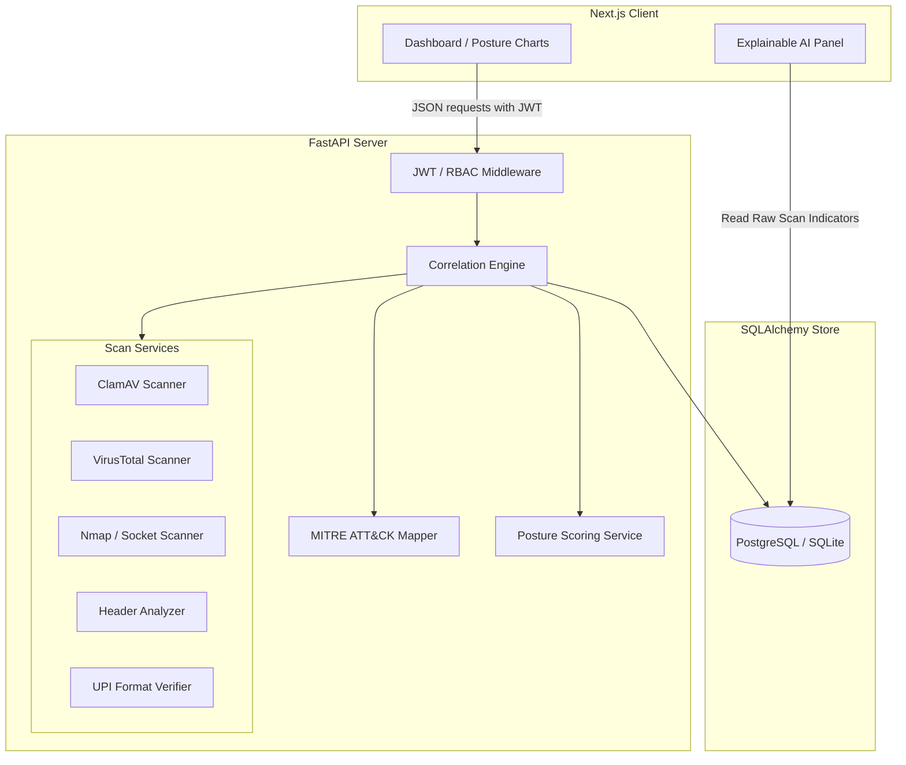

# Vanguard SME Security Suite

A unified Small and Medium Enterprise (SME) cybersecurity scanning and posture-monitoring platform.

[](./frontend)
[](./backend)
[](./backend)
[](./frontend)
[](./backend)

## Table of Contents
- [What This Is](#what-this-is)
- [Key Features](#key-features)
- [Architecture](#architecture)
- [Tech Stack](#tech-stack)
- [Screenshots](#screenshots)
- [Getting Started](#getting-started)
- [Known Limitations & Roadmap](#known-limitations--roadmap)
- [License](#license)

---

## What This Is
Vanguard SME Security Suite is a portfolio-level cybersecurity console designed to help small businesses audit their primary attack surfaces. It provides a web-based dashboard that aggregates threat detection across multiple vectors—including network ports, email spoofing, files, URLs, and payment IDs—into a unified rolling risk score. Instead of overwhelming non-technical users, the platform emphasizes explainable indicators and maps verified threats directly to MITRE ATT&CK tactics in an auto-generated incident timeline.

---

## Key Features

### 1. Detection Scanners (5 Vectors)
* **File/Malware Scanner**: Performs signature checks using ClamAV on uploaded files using secure UUID-based temp file isolation.
* **URL Reputation Scanner**: Queries VirusTotal APIs to evaluate web link trust and flag known malware or phishing URLs.
* **Network Port Scanner**: Audits open TCP ports on target hosts using Nmap, failing over dynamically to a raw Python socket scanner if Nmap is absent.
* **Email Phishing Analyzer**: Inspects raw email headers to verify SPF, DKIM, and DMARC alignments, alerting on look-alike sender domains.
* **UPI Payment Handle Verifier**: Checks UPI ID formatting and tests handles against common fraud keyword patterns before transaction initiation.

### 2. Posture & Threat Correlation
* **Rolling Posture Score**: Automatically deducts points from a 100-base score when dangerous, infected, or suspicious scans are recorded.
* **IOC Correlation Engine**: Automatically parses scanned assets, IPs, hashes, or payment handles into a structured Indicators of Compromise (IOC) database table.
* **Automated Incident Logging**: Creates detailed incident records instantly when high-severity threats are found.
* **MITRE ATT&CK Mapping**: Matches verified alerts end-to-end to real tactics/techniques (e.g. Discovery `T1046`, Execution `T1129`, or Phishing `T1566.002`).

### 3. Explainability & Reporting
* **Explainable AI Signals**: A collapsible UI panel displaying the deterministic rules and structural data (e.g. SPF status codes or raw port arrays) justifying a risk verdict.
* **Text-Based Incident Reports**: Instant plain-text reports containing incident states, timeline milestones, and mitigation recommendations.

### 4. RBAC Authorization
* **RBAC Roles**: Core JWT-secured endpoints matching user profiles defined in `models.py`: `Admin`, `SOC Analyst`, `Threat Hunter`, `Auditor`, and `Read Only`.

---

## Architecture
The platform is organized as a monorepo containing a FastAPI service communicating with a Next.js client, backed by an SQLite/PostgreSQL database mapping.



---

## Tech Stack

| Component | Technology / Dependencies |
| :--- | :--- |
| **Frontend** | React 19, Next.js 16 (App Router), TypeScript, TailwindCSS, Recharts, Radix UI primitives, Lucide Icons |
| **Backend** | Python 3.10+, FastAPI 0.110, SQLAlchemy 2.0, Uvicorn, SlowAPI (Rate Limiter), PyJWT/Jose (Auth), Cryptography (Direct Bcrypt) |
| **Database** | SQLite (development) / PostgreSQL support via SQLAlchemy ORM |

---

## Screenshots
<!-- 
Developer Note: Before submitting or publishing this repository, run the application and save real screenshots to the paths referenced below.
-->

### Security Dashboard

*Figure 1: Main Dashboard displaying rolling security posture score trend lines, current counts, and recent scans.*

### Explainable AI Signals & Incident Timelines

*Figure 2: Expanded incident investigation panel highlighting structured MITRE mappings and recommended actions.*

---

## Getting Started

### 1. Prerequisites
- **Node.js** v18+ and `npm`
- **Python** v3.10+
- **Nmap** & **ClamAV** (Optional: local fallback socket scanner and signature warnings run if binaries are missing)

### 2. Environment Setup

Configure backend environment variables in `backend/.env` (see [backend/.env.example](./backend/.env.example)):
```env
DATABASE_URL=sqlite:///./cyber_risk_dashboard.db
SECRET_KEY=generate-a-secure-random-string-here
ALLOWED_ORIGINS=http://localhost:3000
VIRUSTOTAL_API_KEY=your_virustotal_api_key_here
AI_SERVICE_URL=http://localhost:5000/analyze
```

Configure frontend environment variables in `frontend/.env.local` (see [frontend/.env.example](./frontend/.env.example)):
```env
NEXT_PUBLIC_API_URL=http://localhost:8000
```

### 3. Installation and Development Runs
The repository root contains commands to install and spin up both services concurrently:

```bash
# Install dependencies for both frontend and backend
npm run install:all

# Run both Next.js and FastAPI services concurrently
npm run dev
```

- **Frontend Application**: Runs at [http://localhost:3000](http://localhost:3000)
- **Backend API**: Runs at [http://localhost:8000](http://localhost:8000)

---

## Known Limitations & Roadmap
This application is designed as a portfolio showcase under deliberate constraints:
1. **UPI Verifier**: Format checks and keyword blocks are done entirely offline. It does *not* query bank-side UPI databases (e.g. via PSP APIs) to verify recipient name ownership.
2. **Text-Only Reports**: Incident export is restricted to plain text. PDF generation is not implemented.
3. **Database Migrations**: Alembic is not configured. The schema is initialized directly on application boot using SQLAlchemy's `Base.metadata.create_all`.
4. **Audit Logging**: The `AuditLog` table is fully modeled, but the API endpoints do not write to or query logs currently.
5. **AI Service Fallback**: If the external AI service URL is unreachable or times out (5 seconds), the API seamlessly falls back to static local heuristics.

---

## License
No license file is currently defined in this repository. The project is created for personal portfolio demonstration purposes. (We suggest applying an **MIT License** for open-source reuse).
