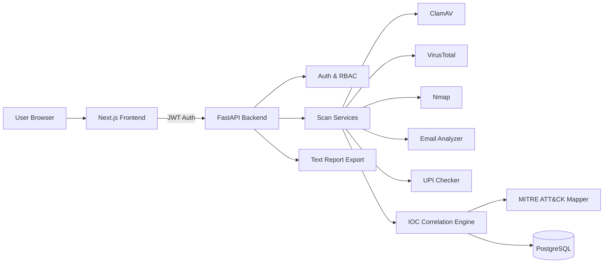

# 🛡️ Vanguard SME Security Suite

**A unified cybersecurity scanning and posture-monitoring platform built for small businesses — personal portfolio project.**


---

## 📋 Table of Contents
- [What This Is](#what-this-is)
- [Features](#features)
- [Architecture](#architecture)
- [Tech Stack](#tech-stack)
- [Screenshots](#screenshots)
- [Getting Started](#getting-started)
- [Known Limitations & Roadmap](#known-limitations--roadmap)
- [License](#license)

---

## What This Is

Vanguard SME Security Suite is a full-stack security platform that lets a small business owner run five different security checks — file/malware, URL, network, phishing email, and UPI payment fraud — from one dashboard, then automatically correlates the results into a running security posture score. Suspicious findings are auto-escalated into incidents mapped against real MITRE ATT&CK tactics/techniques, with plain-language explanations for every verdict.

---

## Features

**Detection Tools**
- 🦠 **File/Malware Scan** — ClamAV-based scanning of uploaded files
- 🔗 **URL Scanner** — VirusTotal-backed reputation and threat lookup
- 🌐 **Network Scanner** — Nmap-based port/service exposure scanning
- ✉️ **Email/Phishing Analyzer** — SPF/DKIM/DMARC validation, lookalike-domain and brand-impersonation detection
- 💳 **UPI Fraud Check** — Format/handle validation with fraud-pattern heuristics (ownership verification is out of scope — see Limitations)

**Security Posture & Correlation**
- 📈 Rolling **Security Posture Score** trend chart aggregating scan history over time
- 🔄 **IOC Correlation Engine** — automatically links related findings and escalates them into incidents
- 🎯 **MITRE ATT&CK Mapping** — every high-severity incident is tagged with a real tactic/technique (e.g. `Discovery → Network Service Discovery (T1046)`), verified working end-to-end against live scan data

**Explainability**
- 🔍 **Detection Signals Panel** — an expandable "how we know" breakdown for every verdict, showing the actual signals that triggered it instead of a black-box score

**Auth & Access**
- 🔐 JWT-based authentication
- 👥 Role-based access control (RBAC) with roles including SOC Analyst, Threat Hunter, and Admin

**Reporting**
- 📄 One-click **text incident report export** for any flagged incident

---

## Architecture



---

## Tech Stack

| Frontend | Backend |
|---|---|
| Next.js (App Router) | FastAPI |
| React | SQLAlchemy |
| TypeScript | PostgreSQL |
| Tailwind CSS | JWT (python-jose) |
| Recharts | bcrypt |
| Lucide Icons | SlowAPI (rate limiting) |

---

## Screenshots

> 📸 Add real screenshots here before publishing — placeholders below.


---

## Getting Started

```bash
# Clone
git clone https://github.com/nayefsiddique-eng/vanguard-sme-suite.git
cd vanguard-sme-suite

# Install everything (frontend + backend deps)
npm run install:all

# Configure environment
cp backend/.env.example backend/.env
# Fill in DATABASE_URL, SECRET_KEY (generate with: python -c "import secrets; print(secrets.token_hex(32))")

# Run both services
npm run dev
```

Frontend: `http://localhost:3000` · Backend: `http://localhost:8000`

---

## Known Limitations & Roadmap

- **UPI verification is format-only** — validates handle structure, not actual PSP-side ownership
- **Reports export as plain text**, not PDF
- **No database migration tooling** — schema is managed via `create_all`, fine for portfolio scale, not production-ready
- **Audit logging** is modeled in the schema but not yet fully wired for all actions

---

## License

No license file yet — all rights reserved by default until one is added.
