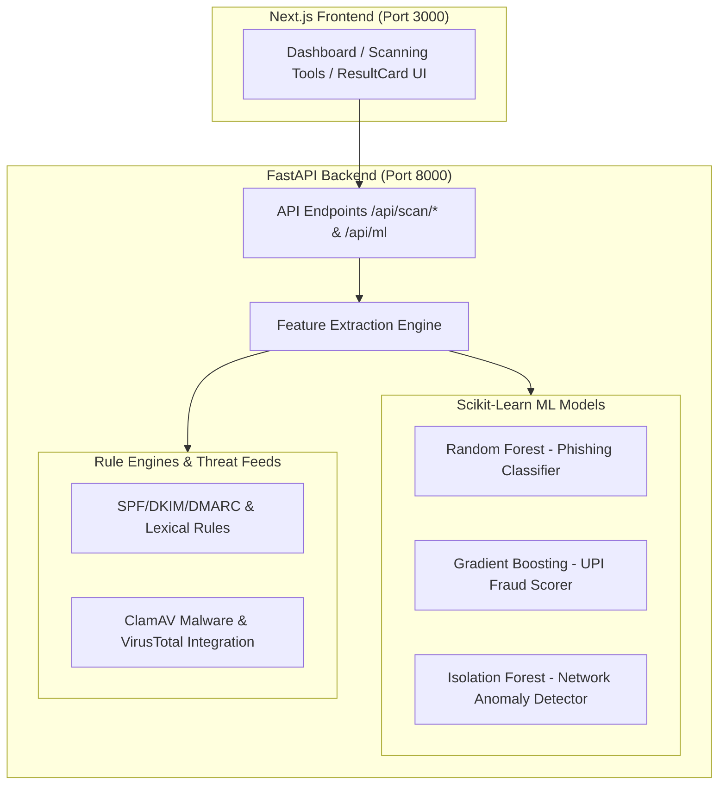

# 🛡️ Vanguard SME Security Suite

**Unified Cybersecurity & Threat Detection Dashboard for Small and Medium Enterprises**

[](https://www.python.org/)
[](https://fastapi.tiangolo.com/)
[](https://nextjs.org/)
[](https://scikit-learn.org/)
[](LICENSE)

---

## 📌 Overview

**Vanguard** is a unified cybersecurity dashboard designed to simplify attack-surface monitoring for Small and Medium Enterprises (SMEs). Built as a full-stack monorepo with FastAPI and Next.js, it aggregates five distinct threat-detection tools into a single authenticated console.

Rather than reporting isolated events, Vanguard pairs traditional heuristic scanning rules with machine learning classifiers (Random Forest, Gradient Boosting, and Isolation Forest) to predict threats, explain findings, and map incidents to the **MITRE ATT&CK** matrix.

---

## 🏗️ Architecture & ML Pipeline


```mermaid
flowchart TB
    subgraph Client["Next.js Frontend (Port 3000)"]
        UI[Dashboard / Scanning Tools / ResultCard UI]
    end

    subgraph Backend["FastAPI Backend (Port 8000)"]
        API[API Endpoints /api/scan/* & /api/ml]
        FE[Feature Extraction Engine]
        
        subgraph Models["Scikit-Learn ML Models"]
            RF[Random Forest - Phishing Classifier]
            GB[Gradient Boosting - UPI Fraud Scorer]
            IF[Isolation Forest - Network Anomaly Detector]
        end

        subgraph Heuristics["Rule Engines & Threat Feeds"]
            Rules[SPF/DKIM/DMARC & Lexical Rules]
            AV[ClamAV Malware & VirusTotal Integration]
        end
    end

    UI --> API
    API --> FE
    FE --> Models & Heuristics
```

---

## 🤖 Machine Learning Model Architecture

| Threat Vector | Algorithm | Model Task | Output Metric | Explainability Mechanism |
|---|---|---|---|---|
| **Email Phishing** | `RandomForestClassifier` | Phishing Detection | Probability (0–100%) | Tree-split `feature_importances_` |
| **UPI Payment Fraud** | `GradientBoostingClassifier` | UPI Fraud Detection | Probability (0–100%) | Boosted `feature_importances_` |
| **Network Anomaly** | `IsolationForest` | Anomaly Detection | Anomaly Score (0–100%) | Ranked Contributing Signals & Indicators |

---

## 🛡️ Key Features & Detection Modules

### 1. Threat Detection Engines
- **Email Phishing Analyzer**: Parses SPF, DKIM, DMARC, and lookalike domain headers, evaluated by a **Random Forest** model.
- **UPI Fraud Verifier**: Validates VPA syntax, flags brand keyword spoofing, and calculates entropy via **Gradient Boosting**.
- **Network Anomaly Scanner**: Port scanner with safe fallback, evaluated by an **Isolation Forest** anomaly detector.
- **Malware & File Scanner**: Scans file uploads against malware signature patterns.
- **URL Reputation Scanner**: Cross-references suspicious URLs against threat intelligence APIs.

### 2. Explainable UX (ResultCard)
- Clear separation between **Heuristic Rule Results** and **ML Model Probabilities**.
- Feature importance visualization displaying why a specific model flagged an asset.
- Built-in AI assistant explaining technical findings in plain language for non-technical business owners.

### 3. Incident Correlation & Posture Monitoring
- **Dynamic Posture Score**: Aggregated health rating based on historical scan telemetry.
- **MITRE ATT&CK Mapping**: High-severity threats are auto-tagged with MITRE tactics and techniques.

---

## 🚀 Quickstart

### Prerequisites
- Python 3.12+
- Node.js 18+

### 1. Backend Setup

```bash
# Navigate to backend
cd backend

# Create and activate virtual environment
python -m venv venv
# On Windows:
.\venv\Scripts\activate
# On Linux/macOS:
source venv/bin/activate

# Install Python dependencies
pip install -r requirements.txt

# Launch FastAPI backend (loads & trains ML models at startup)
uvicorn app.main:app --reload --port 8000
```
*API documentation available at `http://localhost:8000/docs`.*

### 2. Frontend Setup

```bash
# Navigate to frontend
cd frontend

# Install Node dependencies
npm install

# Start Next.js development server
npm run dev
```
*Access web interface at `http://localhost:3000`.*

---

## 🧪 Testing

Run backend tests verifying ML model initialization, scanner endpoints, and authentication:

```bash
pytest backend/test_main.py -v
```

---

## 📁 Repository Structure

```
Vanguard-SME-Security-Suite/
├── backend/
│   ├── app/
│   │   ├── api/             # FastAPI routes for scanning & ML endpoints
│   │   ├── core/            # Config, security, & database settings
│   │   ├── ml/              # Scikit-learn model definitions & feature extractors
│   │   └── services/        # Scanning engine logic (Phishing, UPI, Network)
│   ├── test_main.py         # Pytest integration test suite
│   └── requirements.txt
├── frontend/
│   ├── src/                 # Next.js pages, components, & ResultCard UI
│   ├── public/
│   └── package.json
└── README.md
```
